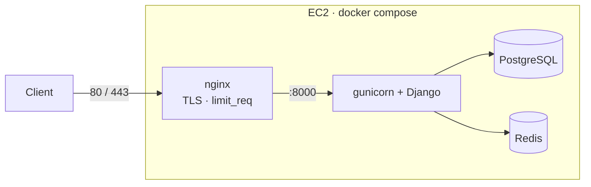

# redirect-service 

A small but production-shaped URL redirect service built with Django 6 and Django REST
Framework. You register **redirect rules** — each gets a short, auto-generated identifier — and
then anyone (or only authenticated users, for private rules) can hit that identifier and get a
`302` to the target URL. The API is JWT-secured, rate-limited, fully documented with Swagger, and
runs the same way on your laptop or on the server.

## Live demo

The service is deployed and running here:

- **App / API:** https://redirect-service.pp.ua/
- **Swagger UI:** https://redirect-service.pp.ua/api/docs/
- **Admin:** https://redirect-service.pp.ua/admin/

Plain HTTP is 301-redirected to HTTPS.

A demo admin account is already created on the server:

```
username: admin
password: admin12345
```

> It's a throwaway demo credential — rotate it for anything real.

## What it does

- **Users & auth.** Accounts are created through the Django admin (no public sign-up). Clients
  authenticate with JWT: `POST /retrieve-token/` returns an access + refresh pair, `/refresh-token/`
  rotates it (the old refresh is blacklisted so it can't be replayed), and `/logout/` blacklists a
  refresh token. Inactive users can't obtain tokens.
- **Redirect rules.** Authenticated users manage their own `RedirectRule` objects via `/url/`
  (list / create / retrieve / update / delete). IDs are UUIDs, the public identifier is a random
  `nanoid`, and the target URL is validated against an `http`/`https` allowlist (blocks
  `javascript:`, `data:`, …). You only ever see and touch your own rules — someone else's rule
  returns **404**, not 403, so the API never reveals that it exists.
- **Redirection.** `GET`/`HEAD` `/redirect/public/<id>/` is open to everyone; `/redirect/private/<id>/`
  requires any authenticated user. Both answer `302` to the target (302, not 301, so changing the
  target isn't cached by browsers); a wrong or mismatched identifier is a clean `404`.
- **Rate limiting (two layers).** nginx `limit_req` throttles by IP at the edge (flood protection
  before requests even reach Django), and DRF throttles the token endpoints and public redirects
  with counters kept in Redis.
- **Observability.** Every request is logged as structured **JSON** with a correlating
  `request_id` (and `user_id`), written to rotating files under `logs/` (`app`, `error`,
  `security`). There's a `/health/` endpoint that pings the database, and errors come back in a
  consistent `{"error": {...}}` envelope.
- **Security.** Behind nginx the app serves over HTTPS (Let's Encrypt) with HSTS, secure cookies,
  and CSRF trusted origins; secrets and settings come from the environment.

## Tech stack

| Area | Choices |
|------|---------|
| Language / framework | Python 3.14, Django 6, Django REST Framework, SimpleJWT |
| Data | PostgreSQL (`psycopg` 3), Redis (`django-redis`) |
| Serving | gunicorn, whitenoise, nginx (reverse proxy + TLS + `limit_req`) |
| Docs / logging | drf-spectacular (OpenAPI/Swagger), `django-structlog`, `concurrent-log-handler` |
| Infra | Docker & Compose, Terraform (AWS EC2), GitHub Actions, Let's Encrypt / certbot |
| Tooling | `uv` (packaging), pytest, ruff, mypy (strict) |

## Project structure

```
redirect-service/
├── src/
│   ├── config/                 # Django project
│   │   ├── settings/           # base + local + production (env-driven)
│   │   ├── logging.py          # structlog → rotating JSON files
│   │   └── urls.py wsgi.py asgi.py
│   ├── apps/
│   │   ├── common/             # UUID/TimeStamped model bases, pagination,
│   │   │                       # uniform error handler, /health/
│   │   ├── users/              # custom User, admin, JWT token endpoints + throttle
│   │   ├── rules/              # RedirectRule model, create_rule service (nanoid),
│   │   │                       # IsOwner permission, owner-scoped CRUD viewset
│   │   └── redirection/        # public/private resolve → 302 + IP throttle
│   ├── conftest.py             # pytest fixtures
│   └── manage.py
├── docker/                     # entrypoint(.dev).sh, gunicorn.conf.py, init-letsencrypt.sh
├── nginx/                      # nginx.conf (HTTP) · nginx.tls.conf (HTTPS)
├── terraform/                  # AWS EC2 provisioning (state & tfvars are gitignored)
├── docker-compose.yml          # base: db + redis + web
│   + docker-compose.dev.yml    #   dev overlay  (runserver, live reload)
│   + docker-compose.prod.yml   #   prod overlay (gunicorn + nginx, :80)
│   + docker-compose.tls.yml    #   tls overlay  (certbot + nginx :443)
├── Dockerfile
└── .github/workflows/deploy.yml
```

Everything is one Docker Compose stack on a single host:



## Getting started

There are three ways to work with the project. Pick whichever fits.

### 1) Use the live server

Nothing to install — just talk to the deployed API. Get a token with the demo admin and create a
rule:

```bash
BASE=https://redirect-service.pp.ua

# 1. get an access token
ACCESS=$(curl -s -X POST $BASE/retrieve-token/ \
  -H 'Content-Type: application/json' \
  -d '{"username":"admin","password":"admin12345"}' | python3 -c "import sys,json;print(json.load(sys.stdin)['access'])")

# 2. create a redirect rule
curl -s -X POST $BASE/url/ \
  -H "Authorization: Bearer $ACCESS" -H 'Content-Type: application/json' \
  -d '{"redirect_url":"https://google.com","is_private":false}'

# 3. follow the public redirect (use redirect_identifier from step 2)
curl -I $BASE/redirect/public/<redirect_identifier>/     # → 302 Location: https://google.com
```

Or just open the Swagger UI at <https://redirect-service.pp.ua/api/docs/> and try it in the browser.

### 2) Run locally (uv)

For development you need Python 3.14 (via [uv](https://docs.astral.sh/uv/)) and a Postgres + Redis.
The quickest way to get the databases is a couple of throwaway containers:

```bash
uv sync

docker run -d --name rs-pg -e POSTGRES_DB=redirect -e POSTGRES_USER=redirect \
  -e POSTGRES_PASSWORD=redirect -p 5432:5432 postgres:17-alpine
docker run -d --name rs-redis -p 6379:6379 redis:8-alpine

cp .env.example .env                         # sane local defaults are already filled in
uv run python src/manage.py migrate
uv run python src/manage.py createsuperuser   # or rely on DJANGO_SUPERUSER_* from .env
uv run python src/manage.py runserver         # http://127.0.0.1:8000/
```

Tear the databases down with `docker rm -f rs-pg rs-redis` when you're done.

### 3) Run with Docker Compose

The Compose setup is a base file plus overlays. Locally you run the **dev** overlay; the prod
overlays (`prod` + `tls`) are the server stack and expect real TLS — see [Deployment](#deployment).

```bash
cp .env.example .env

# Dev: gunicorn is replaced by runserver, source is bind-mounted, live reload on :8000
docker compose -f docker-compose.yml -f docker-compose.dev.yml up -d --build
```

Then open `http://localhost:8000/`. The container bootstraps itself (wait for DB → migrate →
collectstatic → create the `DJANGO_SUPERUSER_*` admin → start the server), so with the default
`.env` you again get **admin / admin12345**.

Handy:

```bash
docker compose ... exec web python manage.py createsuperuser   # extra admin
docker compose ... exec web tail -f /app/logs/app.log          # live JSON logs
docker compose ... down                                        # add -v to wipe volumes
```

## Configuration

All settings come from environment variables, and `src/config/settings/*` only *read* them —
`.env.example` is the canonical list of keys. Locally you keep them in `.env`; on the server
Terraform writes an equivalent `.env` from `terraform.tfvars`. Admin credentials live in exactly
one place per environment via `DJANGO_SUPERUSER_{USERNAME,PASSWORD,EMAIL}` (there's no hidden or
randomly-generated value).

## API reference

All authenticated endpoints expect `Authorization: Bearer <access>`.

| Method | Path | Auth | Description |
|--------|------|------|-------------|
| POST | `/retrieve-token/` | — | Issue access + refresh from username/password |
| POST | `/refresh-token/` | — | New access token (rotates + blacklists the old refresh) |
| POST | `/logout/` | — | Blacklist a refresh token |
| GET / POST | `/url/` | Bearer | List your rules (paginated) / create one |
| GET / PATCH / DELETE | `/url/<uuid:id>/` | Bearer | Retrieve / update / delete your rule (no `PUT`) |
| GET / HEAD | `/redirect/public/<id>/` | — | `302` to the target (IP rate-limited) |
| GET / HEAD | `/redirect/private/<id>/` | Bearer | `302` to the target (any authenticated user) |
| GET | `/health/` | — | Liveness + DB ping |
| GET | `/api/docs/` | — | Swagger UI (`/api/schema/` for the raw OpenAPI) |

## Testing & quality gates

Tests need a Postgres + Redis reachable on localhost (see the local setup above).

```bash
uv run pytest            # ~25 tests: auth, CRUD/ownership, redirects, throttling, health
uv run ruff check src    # lint, incl. Google-style docstrings (D) and type annotations (ANN)
uv run mypy src          # strict type checking (django-stubs)
```

## Deployment

The server is a single AWS EC2 instance described in `terraform/` (VPC, security group, Elastic
IP, the instance, and an IAM user for credentials). On first boot the instance installs Docker,
clones the repo, writes its `.env`, and brings up the prod Compose stack.

```bash
cd terraform
export AWS_PROFILE=redirect-service
terraform init
terraform apply
```

TLS is issued by Let's Encrypt once the domain points at the instance:

```bash
# on the server, from the repo root — one-time; certbot then auto-renews
sudo DOMAIN=redirect-service.pp.ua EMAIL=you@example.com bash docker/init-letsencrypt.sh
```

Pushes to `main` run GitHub Actions: the quality gate (ruff → mypy → pytest against service
containers), then an SSH deploy that pulls, rebuilds the stack (with TLS), and smoke-tests
`/health/`.
